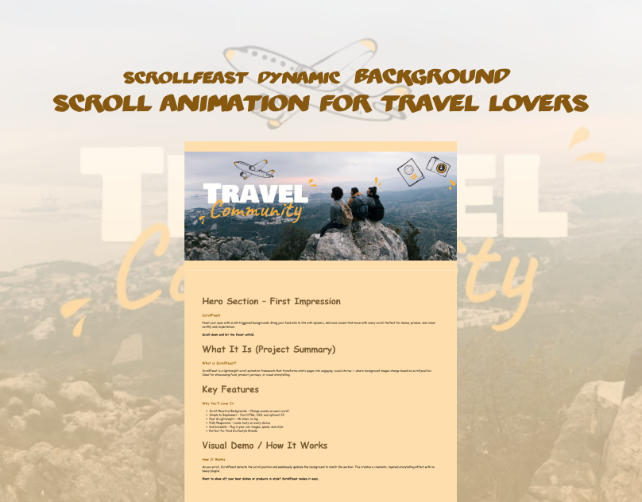

# 🍔 ScrollFeast | Dynamic Background Scroll Animation for Travel Lovers

**ScrollFeast** is a visually engaging, scroll-triggered background animation project designed to elevate Travel and lifestyle websites. As users scroll through the page, bold background images change to create an immersive storytelling experience — perfect for fast Travel brands, menus, product reveals, or interactive landing pages.

## 🚀 Profile 
<a href="https://www.linkedin.com/in/dharmendraverma95/" target="_blank">🧑‍💻 LinkedIn Profile </a> | <a href="https://www.behance.net/dhirukumar" target="_blank">🧑‍💻 Behance Profile </a>

---

## 🎯 Features

- 🍕 **Scroll-Based Background Image Transitions**
- ⚡ **Smooth Performance with Lightweight HTML, CSS & JS**
- 🎨 **Fully Customizable for Travel, Lifestyle & Product Brands**
- 📱 **Responsive Design for All Devices**
- 🧩 **Easy Integration into Any Website or Landing Page**

---

## 🛠️ How It Works

ScrollFeast tracks the user’s scroll position and updates the background of each section accordingly. This creates a dynamic parallax-like effect with zero dependencies.

---

## 📁 Project Structure
ScrollFeast/
├── index.html
├── styles.css
├── script.js
├── assets/
│ ├── background1.jpg
└── README.md

## 📦 Tech Stack
- HTML5
- CSS3 (with background-attachment and scroll effects)
- Vanilla JavaScript

👉 Desktop Design 

👉 Cover Design 
